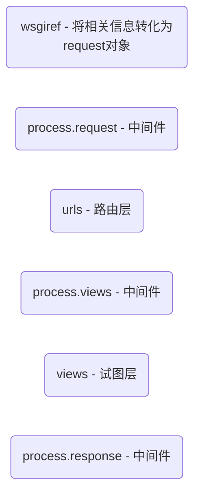

# Django介绍
## Django的生命周期

```mermaid
graph LR
    1(wsgiref - 将相关信息转化为request对象)
    2(process.request - 中间件)
    3(urls - 路由层)
    4(process.views - 中间件)
    5(views - 试图层)
    6(process.response - 中间件)
```
