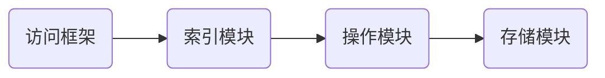

# 基本架构：一个键值数据库都包含什么
##  可以存什么要的数据？
> 主要存储两个数据，一个是key，一个是value

key的类型为： string
value的类型为：string，哈希表，列表，集合等（编程常用的数据类型基本都可存储）

## 可以做什么操作？
- get
- put or set
- delete
- scan  轮询
- exists

## 存储介质是什么，也就是（数据存储在内存还是外存）？
Redis经常使用缓存的场景，对速度要求较高，所以得使用**内存**进行存储

## 整个数据库都有哪些功能组件？
一个键值数据库包括了**访问框架、索引模块、操作模块和存储模块**四部分（见下图）

接下来将会根据以下流程图进行解释

- ### 访问框架的选择
> 一般存在两种访问框架可进行选择：添加动态链接库，使用网络socket通信访问

**Redis的访问框架选择的是网络socket通信访问**
- 网络socket通信访问的优点：方面扩大了键值数据库的受用面
- 网络socket通信访问的缺点：给键值数据库的性能、运行模型提供了不同的设计选择，带来了一些潜在的问题。

- ### 索引模块是用来干啥的(如何定位键值对的位置？)
> 索引的作用是让键值数据库根据 key 找到相应 value 的存储位置，进而执行操作。

**Redis 采用哈希表作为 key-value 索引**,很大一部分原因在于，其键值数据基本都是保存在内存中的，**而内存的高性能随机访问特性可以很好地与哈希表 O(1) 的操作复杂度相匹配**。

- ### 操作模块都有哪些功能
- 对于 GET/SCAN 操作而言，此时根据 value 的存储位置返回 value 值即可；
- 对于 PUT 一个新的键值对数据而言，SimpleKV 需要为该键值对分配内存空间；
- 对于 DELETE 操作，SimpleKV 需要删除键值对，并释放相应的内存空间，这个过程由分配器完成。

不知道你注意到没有，对于 PUT 和 DELETE 两种操作来说，除了新写入和删除键值对，还需要分配和释放内存。这就不得不提 SimpleKV 的存储模块了。

- ### 存储模块里都有哪些功能
- 如何实现重启后快速提供服务？
- 内存分配器：随机的大小内存存块分配，数据规模大，有可能导致内存碎片问题（雪崩现象）

# 对比简单的键值对和redis的区别

从这张对比图中，我们可以看到，从 SimpleKV 演进到 Redis，有以下几个重要变化：
- Redis 主要通过网络框架进行访问，而不再是动态库了
- Redis 数据模型中的 value 类型很丰富，因此也带来了更多的操作接口，例如面向列表的 LPUSH/LPOP，面向集合的 SADD/SREM 等。
- Redis 的持久化模块能支持两种方式：日志（AOF）和快照（RDB）
- Redis 支持高可靠集群和高可扩展集群，因此，Redis 中包含了相应的集群功能支撑模块。
