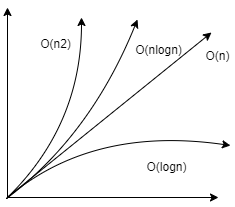

# 第一章 评测你的算法

- [第一章 评测你的算法](#第一章-评测你的算法)
  - [我为什么要评估?](#我为什么要评估)
  - [时间复杂度](#时间复杂度)

## 我为什么要评估?

- ### 事后再统计有局限
  > > >
      1. 测试结果以来测试环境
      2. 测试结果受数据规模影响大
  > > >

## 时间复杂度

1. 如何开始时间复杂度：

```
一行代码的时间复杂对为1 => 时间复杂度为O（1）
```

2. 使用技巧

```
1.只关注循环执行次数最多的一行代码（即循环主体）
2.总复杂度等于量级最大的那段代码的复杂度（加法法则）
3.嵌套代码的复杂度等于嵌套内外代码的复杂度的乘积（乘法法则）
4.忽略常数，忽略系数
```

3. 常见量级

- 常量阶：O（1）
- 对数阶：O（logn）
- 线性阶：O（n）
- 线行对数阶：O（nlogn）
- 平方阶：O(n2) O(n3) O(nk)

4. 对对数阶样例分析
- 问题样例
```python
i = 1
while i < n:
    i *= 2
```
- 结果推算:

| i的值  | 1  | 2 | 4 | 8 |
|---|---| ---| ---| ---|
|  循环结果 | 2  | 4 | 8 | 16|
|  转换次幂 | 1 | 2 | 3 | 4 |

转换次幂为 (2x = n) => (x = log2n) => (x = logn)
>扩展：整体复杂度为O(nlogn) while 的值乘以n 。也就是外面套个n的for循环
5. 时间复杂度升级分析：
- 最好情况时间复杂度
- 最坏情况时间复杂度
- 均数时间复杂度
- 平均时间复杂度（加权平均值）
