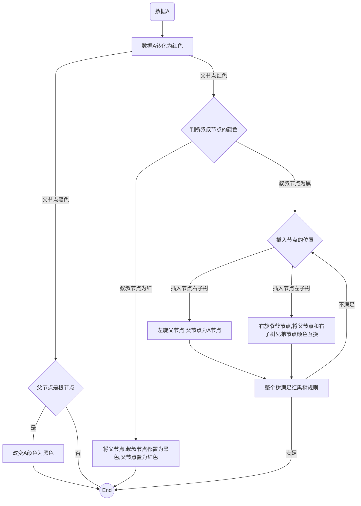

[toc]

# 树

```
节点命名：父节点、子节点、兄弟节点、叶子节点、根节点
属性命名： 树的高度（叶子节点到根的距离）、树的深度（根到叶子节点的距离）、树的层数（从根开始算1到叶子的长度）
```

## 二叉树

```
大部分二叉树代码都是通过链式结构进行存储。用数组会浪费空间
但是完全二叉树用数组存储是最节省空间的
```

### 满二叉树

> （二叉树除叶子节点外，都有左右节点，形状是个三角形）

### 完全二叉树

> （除最后一层外，每一层都得满，并且最后一层得从左到右填充）

计算方式：

> 如果节点 X 存储在数组中下标为 i 的位置，
> 下标为 2 _ i 的位置存储的就是左子节点，
> 下标为 2 _ i + 1 的位置存储的就是右子节点。
> 反过来，下标为 i/2 的位置存储就是它的父节点。
> 通过这种方式，我们只要知道根节点存储的位置（一般情况下，为了方便计算子节点，根节点会存储在下标为 1 的位置）

### 二叉树的遍历

> （前序、中序、后序），以父节点为基点。时间复杂度为 0n

### 二叉查找树

> （主要优点为范围查找，顺带支持等值查找）
> 二叉查找树要求，在树中的任意一个节点，其左子树中的每个节点的值，都要小于这个节点的值，而右子树节点的值都大于这个节点的值。

-   查找
    > 先从根节点开始比较，小的到左子树遍历，大的到右子树遍历
-   插入
    > 先到根节点比较，小的到左子树，大的到右子树直到最后的叶子结点。
-   删除
-   中序遍历二叉查找树，输出的是一个排序的数组
-   去除重复的方法（右子树存放大于等于，或直接存在数据中（卫星数据））
#### 平衡二叉查找树
##### 红黑树
> 红黑树是一种平衡二叉查找树。它是为了解决普通二叉查找树在数据更新的过程中，复杂度退化的问题而产生的。红黑树的高度近似 log2n，所以它是近似平衡，插入、删除、查找操作的时间复杂度都是 O(logn)。

- **相关要求：**
  - 根节点是黑色的；
  - 每个叶子节点都是黑色的空节点（NIL），也就是说，叶子节点不存储数据；
  - 任何相邻的节点都不能同时为红色，也就是说，红色节点是被黑色节点隔开的；
  - 每个节点，从该节点到达其可达叶子节点的所有路径，都包含相同数目的黑色节点；
---
- **分析红黑树的牛逼之处：为什么红黑树近似平衡**
> 如何证明红黑树近似平衡
```
- 二叉树的性能和树的高度相关
- 平衡的二叉树的高度为log2n
- 只要证明红黑树的高度为log2n就证明红黑树近似平衡
```
> 如何证明红黑树的高度为log2n
```
- 全黑树的高度比相同数据的完全二叉树的高度小，完全二叉树的高度近似为log2n
- 将红色节点加上，由于第三个要求，相邻的节点不能同时为红色，推出，黑色+红色最多为2倍的黑色节点，也就是高度最多为2log2n
```
---
**- 红黑树的相关操作**
> 红黑树相关的概念操作：节点左旋，节点右旋，调换颜色。 左旋和右旋值得是二维选择，不是空间旋转，即左叶子节点上浮，或右叶子节点上浮对树进行的调整


1. 插入流程

2. 删除流程
TODO
## 堆

>堆是一个完全二叉树；堆中每一个节点的值都必须大于等于（或小于等于）其子树中每个节点的值。

### 堆常用操作
- 堆化
```
从下往上的堆化方法：
1. 加到数组的最后
2. 沿着叶子节点的路径逐渐向上挨个对比
3. 比较大小进行交换
```
- 插入数据
```
插入栈顶后，对堆进行堆化
```
- 删除数据
```
将栈顶元素和删除元素进行交换，弹出栈顶元素， 堆化
```

### 堆排序
> 快速排序的性能要比堆排序好，这是为什么呢？
> 第一点，堆排序数据访问的方式没有快速排序友好。不是顺序访问对CPU缓存不友好
> 第二点，对于同样的数据，在排序过程中，堆排序算法的数据交换次数要多于快速排序。

**推排序的流程：**
> 我们不需要堆化。实际上，对于完全二叉树来说，下标从 2/n​+1 到 n 的节点都是叶子节点。
1. 建堆
```
- 建堆是原地的，无需新增内存，建堆有两种思路：
1. 从数组头到尾，遍历一遍，假设推只有一个元素，挨个插入进行堆化比较（需要遍历所有的元素）
2. 从最后一个非叶子节点的位置开始反向遍历数组，依次进行退化即可

```
2. 排序
```
堆顶元素和最后叶子节点交换位置，对n-1的数组再次进行堆化，最后就会得到一个1-9的数组，也就是降序的数组=》 大堆会出一个降序的数组，反之。
```
## 常用的应用
## 1.优先队列
> 赫夫曼编码、图的最短路径、最小生成树算法都用到了
- 合并有序小文件：（从小文件获取新数据时，用推化或在插入时对元素进行排序）堆化比较的次数，也可以用二分法进行处理寻找。
- 高性能定时器：只比较最小的那个定时任务，若最小定时任务到时间，将所有的定时任务减去最小定时任务的时间即可。
## 2.求top K
对数组中K位数进行小堆化，对K+1~n的数与堆顶最小数进行比较，大于即弹出栈顶元素，插入堆顶，进行堆化，
## 3.动态数据求中位数（除了中位数还能求其他的百分比位置）
- 维护两个堆，大顶推维护小数据，小顶堆维护大数据（大顶推堆顶元素和小堆顶的堆顶元素就是中位数）
- 大于小顶堆就插入小顶堆，小于或等于大顶堆插入大顶堆
- 当小顶堆的数量大于大顶堆，进行调整
- 当大顶堆的数量大于或等于2小顶堆， 进行调整

# 图
> 相关概念：顶点、边、度；有向图、入度、出度；带权图

## 图的存储方式
### 邻接矩阵（二维数组）
**实现的流程**
```
- 存储无向图，对A[i][j]和A[j][i] 设置为1
- 存储有向图，i-j 对A[i][j] = 1 
- 存储带权无向图，在无向图的基础上数组存储具体的数

```
---
**缺点**
```
无向图的存储会浪费一般的内存，因为a[i][j] == a[j][i]
```
---
**优点**
```
用邻接矩阵的方式存储图，可以将很多图的运算转换成矩阵之间的运算
```
### 邻接表
> 默认就是一个数组，每个元素后边接个链表（可以升级为红黑树，跳表等），最好是跳表

记录出度用邻接表，记录入度用逆邻接表
## 图的遍历查找
### DFS
### BFS
