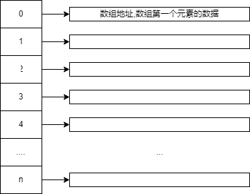

# 数组
[toc]
## 数组是个啥？
>数组是一种线性表结构，他用一组连续的内存空间，内存一组具有相同类型的数据。
## 数组在计算机的底层实现逻辑是什么
申请数组流程
```
1. 用户指定数组大小n
2. cpu到内存中寻找一块连续的内存，必须是连续的并且大小等于n的内存。
3. 将找到的内存的第一块内存的地址，返回用户，并且锁定n长的内存，例如：申请地址为123344,长度为n 那么123344~ 123344 + n 都作为数组的内存大小
```
## 数组的特点是什么
> 支持随机访问（下标访问）， 因为地址是连续的，只需要简单的做加法就能找到指定元素的访问地址

## 数组常用的操作都有哪些
1. 增加（插入）: insert, append
- > insert k: k-n元素后移，插入指定位置后续的所有元素都得后移
- > append 数组最后添加: O（1）
2. 删除：delete， pop
- > delete k: k-n 元素前移，删除指定位置后续的所有元素都得前移
- > pop 数组最后一个元素弹出: O(1)
3. 修改：update
- > update k: 随机访问时间O(1)
4. 查看: match
- > 无序查找 O(n)
- > 随机访问O(1)
5. 扩容：
> 分配一块更大的连续的内存，将原来的数据复制过去， 优化的流程：**先将要插入的元素挪到新数组的指定位置，复制原先的数据可以放到后续的操作异步进行**
## 数组的不可取代
### 数组能被容器ArrayList取代么?
- ArrayList的优势：将数组操作细节全部封装，支持动态扩容，但是由于考虑了其他的问题，会有性能消耗
- array: 操作自己实现，但是无其他用不到的其他操作
**业务开发用ArrayList,底层代码开发用array数组**

## 为什么数组的下标从0开始
1. C语言一开始从0开始，历史原因
2. 0下标代表的是当前的数组的地址位置,默认会加一，为了复原会多一次加法

## 数组的笔试题
### 1. 单列表求n数能否有可以获取指定的数之和（乘积，之差，都是一个道理）<font color=green>绿色</font>
- #### 两数之和
> 前后索引搜索|将多因素同时查询，转化为单因素查询思想
```python3
class Solution:
    def twoSum(self, nums: List[int], target: int) -> List[int]:
        answer2index = {}
        for index, num in enumerate(nums):
            search_num = target - num
            if answer2index.get(search_num):
                return [answer2index[search_num], index]
            answer2index[num] = index
        return None

```
### 2. 寻找两个正序数组的中位数
> 有序数组的合并、中位数的概念
