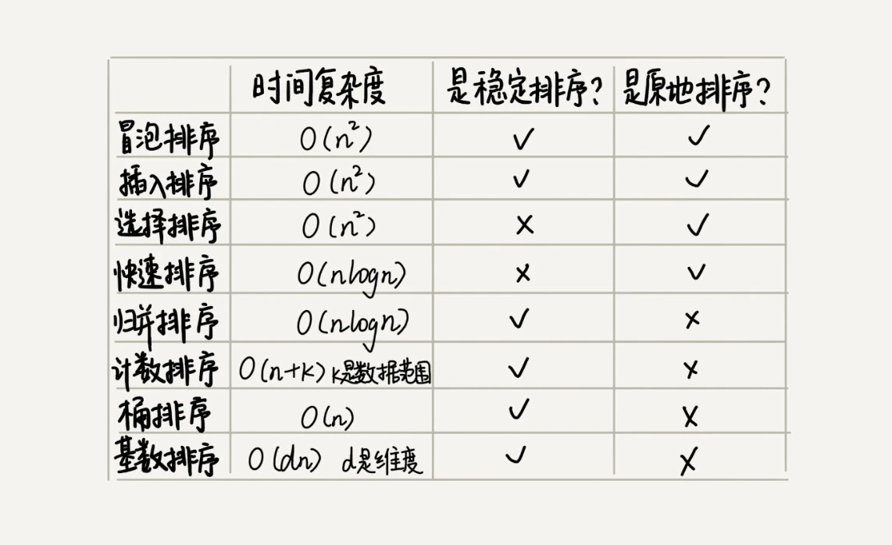

# 高效的排序算法
[toc]
## 分析待排序的数组的有序度
> 逆序度 = 满有序度 - 有序度。
> 我们排序的过程就是一种增加有序度，减少逆序度的过程，最后达到满有序度，就说明排序完成了。
## 原地排序算法
冒泡排序、插入排序、选择排序这三种排序算法，它们的时间复杂度都是 O(n2)，比较高，适合小规模数据的排序
|   | 是否原地排序  |是否是稳定  | 最好 最坏 平均 |
|---|---|---|---|
|  冒泡排序 |  Y | Y | O(n) O(n2) O(n2) |
|  插入排序 |  Y | Y | O(n) O(n2) O(n2) |
|  选择排序 |  Y | N | O(n2) O(n2) O(n2) |
>这三种时间复杂度为 O(n2) 的排序算法中，**冒泡排序、选择排序，可能就纯粹停留在理论的层面了**，学习的目的也只是为了开拓思维，实际开发中应用并不多，但是**插入排序还是挺有用的。后面讲排序优化的时候，有些编程语言中的排序函数的实现原理会用到插入排序算法。**

### 冒泡算法
### 插入排序
>如果你对插入排序的优化感兴趣，可以自行学习一下希尔排序。
### 选择排序
## 大规模的数据排序
两种时间复杂度为 O(nlogn) 的排序算法，归并排序和快速排序。这两种排序算法适合大规模的数据排序
**归并排序和快速排序都用到了分治思想.**

### 归并排序
>如果要排序一个数组，我们先把数组从中间分成前后两部分，然后对前后两部分分别排序，再将排好序的两部分合并在一起，这样整个数组就都有序了。
### 快速排序
>排序数组中下标从 p 到 r 之间的一组数据，我们选择 p 到 r 之间的任意一个数据作为 pivot（分区点）。
>默认最后一个为分区点
解决相关问题：
- 如何用快排思想在O(n)内查找第K大元素？

## 线性排序
桶排序、计数排序、基数排序，因为这些排序算法的时间复杂度是线性的，所以我们把这类排序算法叫作线性排序（Linear sort）。之所以能做到线性的时间复杂度，主要原因是，这三个算法是非基于比较的排序算法，都不涉及元素之间的比较操作。
### 桶排序（Bucket sort）
>首先，我们来看桶排序。桶排序，顾名思义，会用到“桶”，核心思想是将要排序的数据分到几个有序的桶里，每个桶里的数据再单独进行排序。桶内排完序之后，再把每个桶里的数据按照顺序依次取出，组成的序列就是有序的了。

使用场景：
- **桶排序比较适合用在外部排序中**。所谓的外部排序就是数据存储在外部磁盘中，数据量比较大，内存有限，无法将数据全部加载到内存中。

### 计数排序（Counting sort）
> 计数排序其实是桶排序的一种特殊情况。当要排序的 n 个数据，所处的范围并不大的时候，比如最大值是 k，我们就可以把数据划分成 k 个桶。每个桶内的数据值都是相同的，省掉了桶内排序的时间。

流程：
1. 获取原先的数组: A = [2，5，3，0，2，3，0，3]
2. 生产桶存储个数的数组： C = [2, 0, 2, 3, 0 ,1]
3. 用C转换为总数转化数组： S = [2, 2, 4, 7, 7 ,8]
4. 生成排序的数组：R = [0] * 8
5. 循环A获取值k, 获取k在S中的值，代表小于等于k的数有S[k]个， -》 R[S[K] - 1] = K
6. 直到结果完

使用场景：
>计数排序只能用在数据范围不大的场景中，如果数据范围 k 比要排序的数据 n 大很多，就不适合用计数排序了。而且，计数排序只能给非负整数排序，如果要排序的数据是其他类型的，要将其在不改变相对大小的情况下，转化为非负整数。

解决相关问题：
- 每个分数的考生在有序数组中对应的存储位置呢

### 基数排序（Radix sort）
>基数排序对要排序的数据是有要求的，需要可以分割出独立的“位”来比较，而且位之间有递进的关系，如果 a 数据的高位比 b 数据大，那剩下的低位就不用比较了。除此之外，每一位的数据范围不能太大，要可以用线性排序算法来排序，否则，基数排序的时间复杂度就无法做到 O(n) 了。

## 排序的选择
### 各个排序的相关性能排序


### 分析排序选的逻辑
- 线性排序算法的时间复杂度比较低，适用场景比较特殊。所以如果要写一个通用的排序函数，不能选择线性排序算法
- 如果对小规模数据进行排序，可以选择时间复杂度是 O(n2) 的算法；如果对大规模数据进行排序，时间复杂度是 O(nlogn) 的算法更加高效
- 时间复杂度是 O(nlogn) 的排序算法不止一个，我们已经讲过的有归并排序、快速排序、堆排序。归并排序并不是原地排序算法，空间复杂度是 O(n)。所以，粗略点、夸张点讲，如果要排序 100MB 的数据，除了数据本身占用的内存之外，排序算法还要额外再占用 100MB 的内存空间，空间耗费就翻倍了。
>堆排序和快速排序都有比较多的应用，比如 Java 语言采用堆排序实现排序函数，C 语言使用快速排序实现排序函数。

### 优化快速排序的方法
#### 1. 为什么快速排序需要优化
最坏情况下快速排序的时间复杂度是 O(n2)
#### 2. 最坏情况下快速排序的时间复杂度是 O(n2)
如果数据原来就是有序的或者接近有序的，每次分区点都选择最后一个数据，那快速排序算法就会变得非常糟糕，时间复杂度就会退化为 O(n2)
#### 3. 这个的原理是什么呢
主要原因还是因为我们分区点选得不够合理。最理想的分区点是：被分区点分开的两个分区中，数据的数量差不多。

#### 4. 那么怎么优化呢
1. 三数取中法
```
我们从区间的首、尾、中间，分别取出一个数，然后对比大小，取这 3 个数的中间值作为分区点。这样每间隔某个固定的长度，取数据出来比较，将中间值作为分区点的分区算法，肯定要比单纯取某一个数据更好。但是，如果要排序的数组比较大，那“三数取中”可能就不够了，可能要“五数取中”或者“十数取中”。
```

2. 随机法
```
随机法就是每次从要排序的区间中，随机选择一个元素作为分区点。这种方法并不能保证每次分区点都选的比较好，但是从概率的角度来看，也不大可能会出现每次分区点都选得很差的情况，所以平均情况下，这样选的分区点是比较好的。时间复杂度退化为最糟糕的 O(n2) 的情况，出现的可能性不大。
```
#### 5. 分析Glibc-qsort的实现逻辑
- 在快速排序的过程中，当要排序的区间中，元素的个数小于等于 4 时，qsort() 就退化为插入排序，
- qsort() 会优先使用归并排序来排序输入数据，因为归并排序的空间复杂度是 O(n)，所以对于小数据量的排序，比如 1KB、2KB 等
- 要排序的数据量比较大的时候，qsort() 会改为用快速排序算法来排序。
