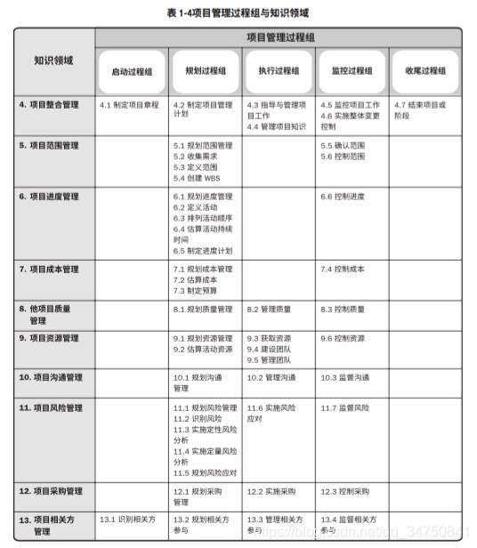

# 1. 学习目标
低成本通过考试
掌握项目管理基本原理
掌握项目管理中的流程化思维方式

# 2. 学习计划
## 2.1 基础部分（5小时）
快速阅读《系统集成项目管理工程师考试32小时通关》（红白配色），熟悉项目管理的大体逻辑，不需要专门记忆，做一下每章的习题，不用做模拟套题。

不推荐使用官方教材，官方教材太厚，重点零散，学习成本高。不推荐看视频，时间成本高。

## 2.2 定向记忆（2小时）
理解记忆以下内容

- 五大过程组：启动过程组-规划过程组-执行过程组-监控过程组-收尾过程组

- 十大领域：
  1. 项目整合管理
  2. 项目范围管理
  3. 项目进度管理
  4. 项目成本管理
  5. 项目质量管理
  6. 项目资源管理
  7. 项目沟通管理
  8. 项目风险管理
  9. 项目采购管理
  10. 项目相关方管理

47个过程：输入、输出、常用工具
## 2.3 计算题（3小时）
使用《系统集成项目管理工程师考试教程计算类试题详解》（蓝黄配色）学习，每类问题做2-3道练习题。

## 2.4 真题练习（5小时）
使用环球网校（网页）、历年真题（pdf下载免费）、科科过（小程序）等工具做近5年考试真题，理解并记忆每一道真题的考点。

## 2.5 考前突击（2小时）
应试技巧
考前入睡宝典
# 3. 学习资料
## 3.1 官方教材
纸质：云孚书架

电子：百度网盘/数据/云孚培训/中级教程：系统集成项目管理工程师教程（第2版）.pdf
链接：https://pan.baidu.com/s/1GnRS3crpf8a841u00VVdug
提取码：dfa2

电子：百度网盘/数据/云孚培训/中级教程：系统集成项目管理工程师教程（第2版）（OCR）.pdf
链接：https://pan.baidu.com/s/1NVXoCLM7bCjoXLp3NeQtMg
提取码：a7dp

## 3.2 其他教材
《系统集成项目管理工程师考试32小时通关》——云孚书架

3.3 视频

如有其他好用的资料请大家自行补充。

内部

2021年上半年内部培训（中级）
外部

https://www.bilibili.com/video/BV1i7411e7NL
https://www.bilibili.com/video/BV1dJ41117Aa
https://www.bilibili.com/video/BV11W411k7t1?p=1
3.4 真题

微信小程序：科科过
最新6套真题免费在线考试：环球网校
在线考试收费，PDF下载免费：历年真题